# Salesforce Developer Quickstart

> **From signup to REST API in 4–5 hours** · Accounts · Contacts · Cases

A self-contained guide for developers with no prior Salesforce experience. You will stand up a free Salesforce Developer Edition, manage records in the UI, then interact with them programmatically using curl, Python, and JavaScript/TypeScript.

---

## Who Is This For?

| You need | You do NOT need |
|---|---|
| A web browser | Prior Salesforce experience |
| A terminal (macOS/Linux/WSL) | Salesforce certification |
| Basic command-line familiarity | Enterprise software background |
| Python or JavaScript experience (for Sections 5–7) | Cloud architecture knowledge |

> **UI sections (docs 01–04):** browser only, no coding required.  
> **API sections (docs 05–07):** copy-paste and run short scripts; step-by-step instructions provided.

## What This Guide Does NOT Cover

- Apex (Salesforce's server-side language)
- Lightning Web Components (Salesforce front-end framework)
- Marketing Cloud, Commerce Cloud, CPQ
- Advanced AI/Agentforce — see [docs/09-developer-edition-scope.md](docs/09-developer-edition-scope.md)

---

## Learning Journey



---

## Learning Path

| Step | Document | Time | What You Will Do |
|------|----------|------|-----------------|
| 0 | [Required Tools](docs/00-required-tools.md) | 10 min | Verify curl, Python, Node.js, uv are installed |
| 1 | [Sign Up & Setup](docs/01-signup-and-setup.md) | 20 min | Create your free Developer Edition org |
| 2 | [User Setup](docs/02-user-setup.md) | 25 min | Create admin + API integration users |
| 3 | [Connected App](docs/03-connected-app.md) | 25 min | Enable OAuth API access |
| 4 | [UI Walkthrough](docs/04-ui-walkthrough.md) | 80 min | Create Accounts, Contacts, Cases in the UI |
| 5 | [curl Quickstart](docs/05-curl-quickstart.md) | 30 min | CRUD via raw HTTP calls |
| 6 | [Python Guide](docs/06-python-guide.md) | 45 min | CRUD with simple-salesforce SDK |
| 7 | [JavaScript Guide](docs/07-javascript-guide.md) | 45 min | CRUD with jsforce SDK (+ TypeScript) |
| — | [Troubleshooting](docs/08-troubleshooting.md) | as needed | When things break |
| — | [Dev Edition Scope & AI](docs/09-developer-edition-scope.md) | reference | Limits, Einstein, Agentforce, BYOLLM |
| — | [Glossary](docs/glossary.md) | reference | Salesforce-specific terminology |
| — | [Learning Resources](docs/learning-resources.md) | reference | Go deeper with Trailhead, official docs |

> **Multi-session?** Use [docs/progress-checklist.md](docs/progress-checklist.md) to track where you stopped.

---

## Environment Setup

```bash
cp .env.example .env
```

Edit `.env` and fill in your credentials (you will collect these during Steps 1–3):

```
SF_USERNAME=your.email@example.com
SF_PASSWORD=yourpassword
SF_SECURITY_TOKEN=yourSecurityTokenHere
SF_CONSUMER_KEY=yourConnectedAppConsumerKey
SF_CONSUMER_SECRET=yourConnectedAppConsumerSecret
SF_INSTANCE_URL=https://yourdomain.my.salesforce.com
SF_API_VERSION=v62.0
```

> ⚠️ **NEVER commit `.env` to git.** It is already in `.gitignore`.

---

## Quick Reference: Run the Examples

**Python:**
```bash
cd python
uv venv && uv pip install -r requirements.txt
uv run python 01_authenticate.py
```

**JavaScript:**
```bash
cd javascript
npm install
node 01_authenticate.js
```

**curl:**
```bash
cd curl
chmod +x *.sh
source authenticate.sh   # sets ACCESS_TOKEN and INSTANCE_URL
bash accounts.sh
```

**Build offline PDF:**
```bash
make pdf   # requires pandoc + xelatex + DejaVu fonts + rsvg-convert
           # see docs/00-required-tools.md for install instructions
```

---

## New to Salesforce Terminology?

Start with the [Glossary](docs/glossary.md) — ~45 key terms explained for developers coming from non-CRM backgrounds.

---

## Contributing

See [CONTRIBUTING.md](CONTRIBUTING.md) for how to add examples, fix docs, or update diagrams.

---

## Author

**David Gwartney** · <david.gwartney@gmail.com>

## License

MIT
