# Step 2: User Setup — Admin and Integration User

**Time:** ~25 minutes  
**What you will have when done:** Two users configured for their roles, with API access ready for the integration user.

---

## Why Two Users?

In production Salesforce environments, human users never share credentials with automated systems. The pattern is:

- **User A (Admin)** — your signup account. Full UI access, manages configuration.
- **User B (Integration User)** — a dedicated service account. API access only, used by your code.

Setting this up now means your code examples will reflect real-world patterns from the start.



---

## User A — Your Admin Account

Your signup account is already configured as a System Administrator. No changes needed for now.

**What User A does:**
- Manages org settings in Setup
- Creates and configures other users
- Owns the Connected App configuration

---

## User B — Create the Integration User

User B is a dedicated API account. Your code authenticates as User B.

### Create the User

1. In Setup, search Quick Find for: `Users`
2. Click **Users** under *Manage Users*
3. Click **New User**
4. Fill in:
   - **First Name:** `Integration`
   - **Last Name:** `User` (or choose any name)
   - **Email:** use a real email you can access (you will get a verification email)
   - **Username:** must be globally unique — try `integration.user+yourname@yourcompany.com`
   - **User License:** `Salesforce`
   - **Profile:** `Standard User`
5. Click **Save**
6. Check the email address you used — click the verification link to set User B's password.

> **Note:** Developer Edition includes 2 standard user licenses + 1 admin. User B uses one of those 2 licenses.

---

## Create an API Permission Set for User B

Permission Sets grant additional access on top of a user's base Profile.

1. In Setup, search Quick Find for: `Permission Sets`
2. Click **Permission Sets** under *Manage Users*
3. Click **New**
4. Fill in:
   - **Label:** `Integration API Access`
   - **API Name:** `Integration_API_Access` (auto-filled)
5. Click **Save**
6. On the Permission Set detail page, click **System Permissions**
7. Click **Edit**
8. Check:
   - **API Enabled** — allows REST API calls
   - **Modify All Data** — allows create/update/delete on all objects
9. Click **Save**

### Assign the Permission Set to User B

1. Return to the Permission Set detail page
2. Click **Manage Assignments**
3. Click **Add Assignments**
4. Select User B from the list
5. Click **Assign**

---

## Get User B's Security Token

Each user has their own security token. User B needs one for API authentication.

1. Log in to Salesforce as **User B** (open an incognito window or a different browser)
2. Click the **gear icon** → **Setup** (or click user avatar → Settings → My Personal Information)
3. In Quick Find, type: `Reset My Security Token`
4. Click **Reset Security Token**
5. Check User B's email inbox for the token

> **Save User B's token** — this is the `SF_SECURITY_TOKEN` value for your `.env` file.

---

## Update Your .env File

At this point, fill in the User B credentials in your `.env` file:

```bash
SF_USERNAME=userb@yourcompany.com        # User B's username
SF_PASSWORD=userbpassword                # User B's password
SF_SECURITY_TOKEN=userBsecurityToken     # User B's security token
```

Leave `SF_CONSUMER_KEY`, `SF_CONSUMER_SECRET`, and `SF_INSTANCE_URL` blank for now — you will fill those in Step 3.

---

## Understanding Profile vs. Permission Set

This distinction confuses many beginners:

| | Profile | Permission Set |
|---|---|---|
| Purpose | Base access template | Additional permissions on top of Profile |
| Per user | Exactly one | Zero or many |
| To restrict | Use Profile | — |
| To add access | — | Use Permission Set |
| Salesforce direction | Legacy (being phased out) | Preferred going forward |

Best practice for production: use the most restrictive Profile possible, then grant specific access via Permission Sets.

---

## Verification Checklist

- [ ] User B account created and verified (email clicked)
- [ ] "Integration API Access" Permission Set created with API Enabled + Modify All Data
- [ ] Permission Set assigned to User B
- [ ] User B's security token received and saved in `.env`

---

**Navigation:** [← Sign Up & Setup](01-signup-and-setup.md) | [README](../README.md) | [Next → Connected App →](03-connected-app.md)

**Official Reference:**
- Create and manage users: <https://help.salesforce.com/s/articleView?id=sf.adding_new_users.htm>
- Permission Sets overview: <https://help.salesforce.com/s/articleView?id=sf.perm_sets_overview.htm>
